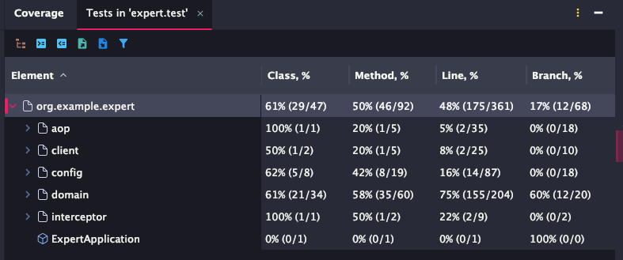

# SPRING ADVANCED

- **테스트 코드** 작성을 통해 기존 코드의 안정성 확보, 유지보수성 향상
- 코드를 효율적으로 검증, 핵심 비즈니스 로직을 깔끔하게 관리

## 기술 스택
- Java 17
- Spring Boot 3.3.3
- Spring Data JPA
- MySQL
- JWT (JSON Web Token)
- BCrypt
- Gradle

## 과제 진행 내용

### Lv 0. 프로젝트 세팅
- 기본 프로젝트 구조 설정

### Lv 1. ArgumentResolver
- `AuthUserArgumentResolver`를 Spring MVC에 등록
- `@Component` 추가로 Bean 등록
- `WebConfig` 생성하여 ArgumentResolver 설정
- 인증 사용자 정보 주입 자동화

### Lv 2. 코드 개선 퀴즈

#### Lv 2-1. Early Return 패턴 적용
- 이메일 중복 체크를 `passwordEncoder.encode()` 실행 전으로 이동
- 불필요한 패스워드 인코딩 작업 방지
- 중첩된 조건문 개선

#### Lv 2-2. 불필요한 if-else 피하기
- `WeatherClient`의 else 블록 제거
- 첫 번째 if에서 예외 발생 시 메소드 종료
- 코드 가독성 향상

#### Lv 2-3. Validation
- Service 계층의 검증 로직을 DTO Validation 어노테이션으로 대체
- `UserChangePasswordRequest`에 검증 어노테이션 추가
- 관심사 분리 및 재사용성 향상

### Lv 3. N+1 문제 해결
- `TodoRepository`에 `@EntityGraph` 적용
- `findAllByOrderByModifiedAtDesc`와 `findByIdWithUser` 메서드 최적화
- `@Query` 추가하여 Spring Data JPA 메소드 이름 파싱 오류 해결

### Lv 4. 테스트 코드 연습

#### Lv 4-1. PasswordEncoderTest 수정
- 기존 테스트 코드 개선

#### Lv 4-2. ManagerServiceTest 수정
- `manager_목록_조회` 테스트의 예외 타입과 메시지 수정
- NPE → InvalidRequestException으로 변경
- 예외 메시지: "Manager not found" → "Todo not found"
- 실제 서비스 코드의 동작과 일치하도록 수정

#### Lv 4-3. CommentServiceTest 수정
- `comment_등록` 테스트의 예외 타입 수정
- ServerException → InvalidRequestException으로 변경
- 실제 CommentService가 던지는 예외와 일치

#### Lv 4-4. ManagerService 버그 수정
- `saveManager`에 null 체크 추가하여 NPE 방지
- `todo.getUser()`가 null일 때 발생하는 문제 해결
- Short-circuit 평가를 활용한 null 체크

### Lv 5. API 로깅
- Spring AOP를 사용한 어드민 API 로깅 기능 구현
- `spring-boot-starter-aop` 의존성 추가
- **AdminAccessInterceptor** 생성
  - 어드민 경로(`/admin/**`)에 대한 접근 로그 기록
  - 요청 시간, userId, email, URI 정보 로깅
- **AdminAccessLoggingAspect** 생성
  - `CommentAdminController.deleteComment()`와 `UserAdminController.changeUserRole()` 메서드에 대한 상세 로깅
  - `@Around` 어드바이스 활용
  - Request body, response body, 실행 시간, 에러 로깅
- `WebConfig`에 Interceptor 등록

### Lv 6. 리팩토링

#### BCrypt 비용 계수 최적화
- 보안 강화를 위해 `BCrypt.MIN_COST` → `10`으로 변경

#### ManagerController JWT 수동 파싱 제거
- 수동 파싱 제거로 코드 간결화
- JWT 관련 로직은 필터에만 존재하도록 의존성 제거
- 코드 포맷 일관성 유지

#### 비밀번호 변경 검증 로직 개선
- 먼저 구 비밀번호가 맞는지 검증
- 새 비밀번호는 평문끼리 비교
- 검증 순서 개선

#### CommentAdminService 존재 여부 확인 추가
- REST 규약 준수: 없는 리소스 삭제 시 404 반환
- 명확한 피드백 제공
- 다른 Service와 일관된 패턴 사용

#### Stream API 적용
- `ManagerService.getManagers()`의 수동 루프를 Stream으로 변환
- `CommentService.getComments()`의 수동 루프를 Stream으로 변환
- 불필요한 ArrayList import 제거
- 코드 간결성 및 가독성 향상

## 테스트 코드

### 단위 테스트 작성
- **AuthService 테스트** - 회원가입, 로그인 기능
- **UserService 테스트** - 사용자 조회, 비밀번호 변경 기능
- **TodoService 테스트** - Todo 저장, 조회 기능
- **CommentService 테스트** - 댓글 관리 기능
- **ManagerService 테스트** - 담당자 관리 기능
- **PasswordEncoder 테스트** - 비밀번호 암호화 기능

## 테스트 커버리지 Line 수치 

